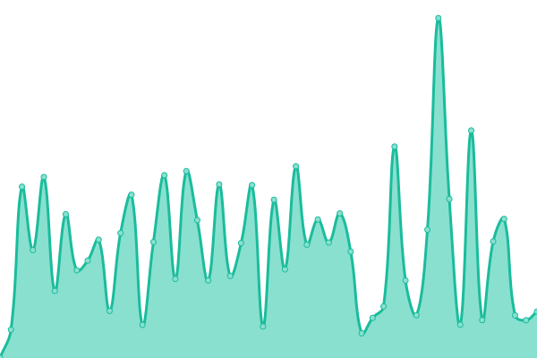

# [📈 Live Status](https://rizalrenaldi.github.io/ruptime): <!--live status--> **🟧 Partial outage**

This repository contains the open-source uptime monitor and status page for [Rizal Renaldi](https://www.rizalrenaldi.com), powered by [Upptime](https://github.com/upptime/upptime).

With [Upptime](https://upptime.js.org), you can get your own unlimited and free uptime monitor and status page, powered entirely by a GitHub repository. We use [Issues](https://github.com/rizalrenaldi/ruptime/issues) as incident reports, [Actions](https://github.com/rizalrenaldi/ruptime/actions) as uptime monitors, and [Pages](https://rizalrenaldi.github.io/ruptime) for the status page.

<!--start: status pages-->
<!-- This summary is generated by Upptime (https://github.com/upptime/upptime) -->
<!-- Do not edit this manually, your changes will be overwritten -->
<!-- prettier-ignore -->
| URL | Status | History | Response Time | Uptime |
| --- | ------ | ------- | ------------- | ------ |
|  [1bitcoin](https://www.satubitcoin.com) | 🟥 Down | [1bitcoin.yml](https://github.com/rizalrenaldi/ruptime/commits/HEAD/history/1bitcoin.yml) | 

 0ms
     
 | 

<a href="https://rizalrenaldi.github.io/ruptime/history/1bitcoin">0.00%</a>
    

|  [SignalSupply](https://signalsupply.co) | 🟩 Up | [signal-supply.yml](https://github.com/rizalrenaldi/ruptime/commits/HEAD/history/signal-supply.yml) | 

 719ms
     
 | 

<a href="https://rizalrenaldi.github.io/ruptime/history/signal-supply">100.00%</a>
    

|  [Logoipsum](https:/logoipsum.com) | 🟩 Up | [logoipsum.yml](https://github.com/rizalrenaldi/ruptime/commits/HEAD/history/logoipsum.yml) | 

 356ms
     
 | 

<a href="https://rizalrenaldi.github.io/ruptime/history/logoipsum">100.00%</a>
    

|  [Fontsss](https://fontsss.com) | 🟩 Up | [fontsss.yml](https://github.com/rizalrenaldi/ruptime/commits/HEAD/history/fontsss.yml) | 

 1764ms
     
 | 

<a href="https://rizalrenaldi.github.io/ruptime/history/fontsss">100.00%</a>
    

<!--end: status pages-->

[**Visit our status website →**](https://rizalrenaldi.github.io/ruptime)

## 📄 License

- Powered by: [Upptime](https://github.com/upptime/upptime)
- Code: [MIT](./LICENSE) © [Rizal Renaldi](https://www.rizalrenaldi.com)
- Data in the `./history` directory: [Open Database License](https://opendatacommons.org/licenses/odbl/1-0/)
